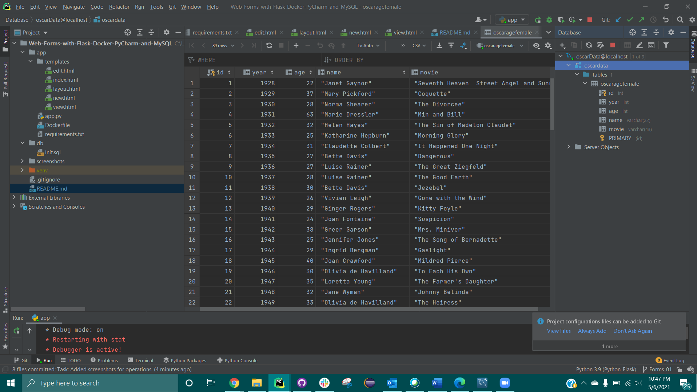
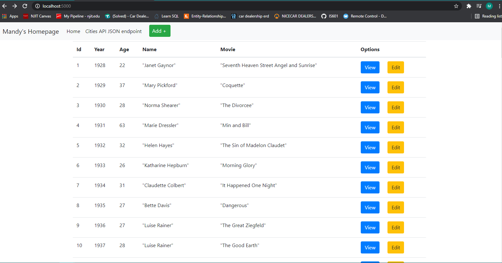
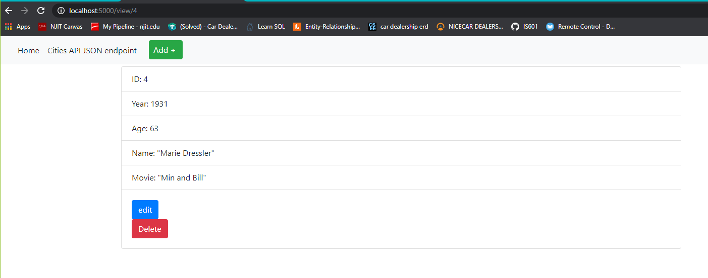
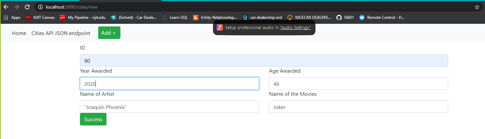
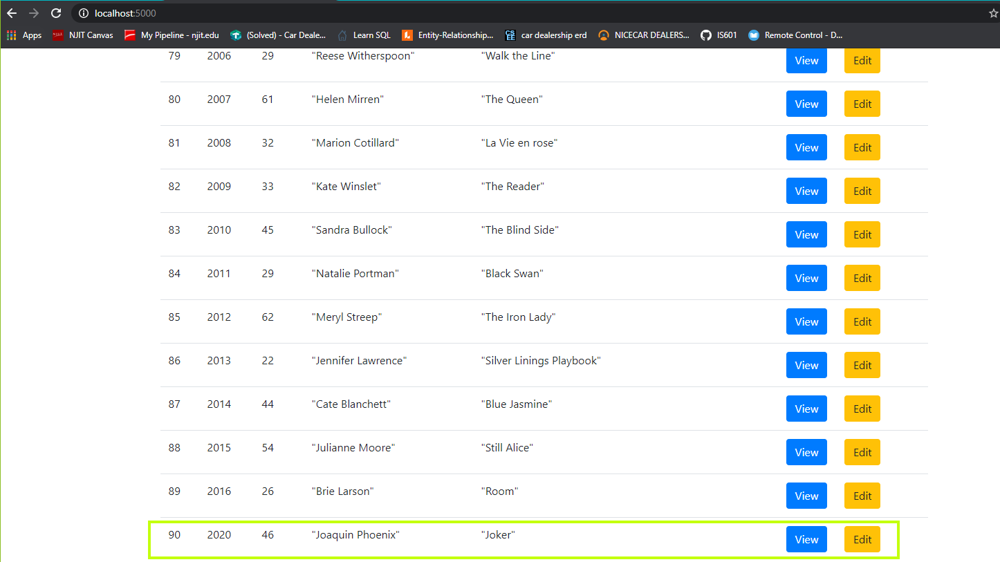
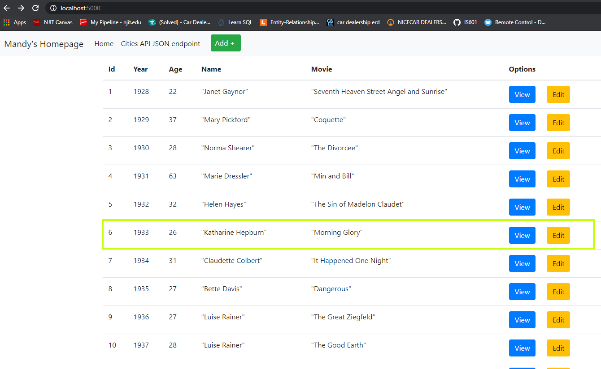
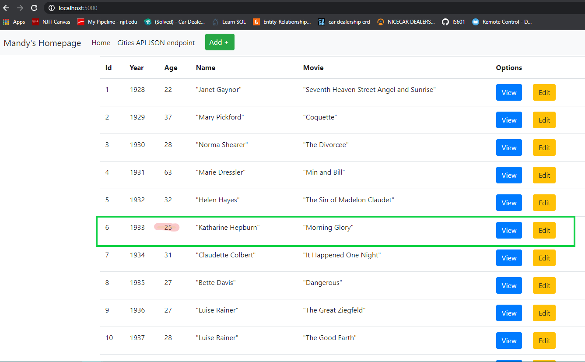
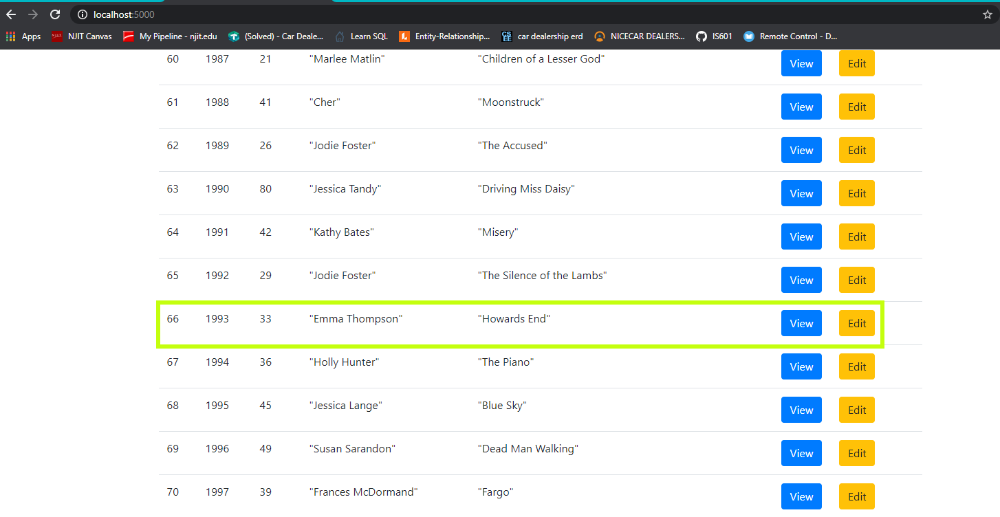
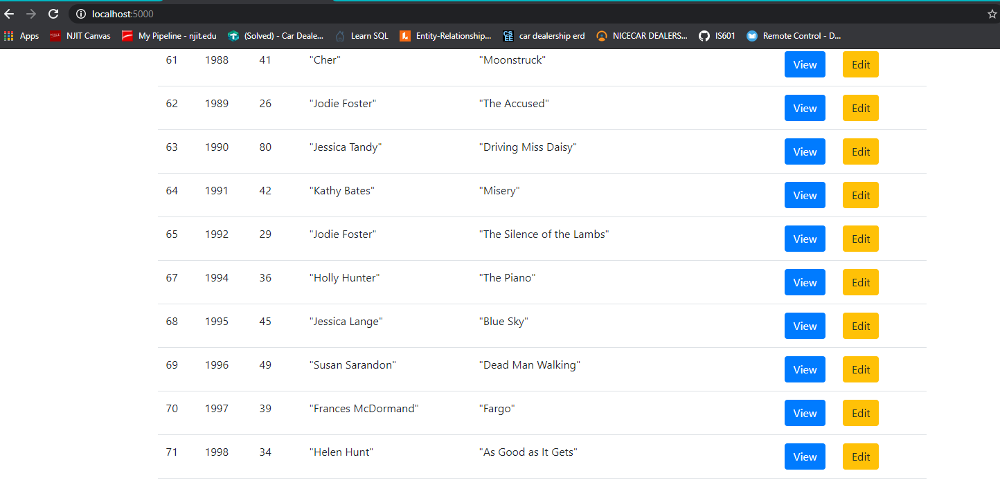

# Project Title
# Web-Forms with Flask, PyChar and MySQL

# Project Description
## This project is being built to create Web-forms to add new records, update and delete data.

# Images
### Pycharm database 

### Home 

### ViewRecord 

### Insert new record's page 
### After record insertion 

### Before Record Update 
### After Record Update 

### Before Record Delete 
### After Record Delete 
